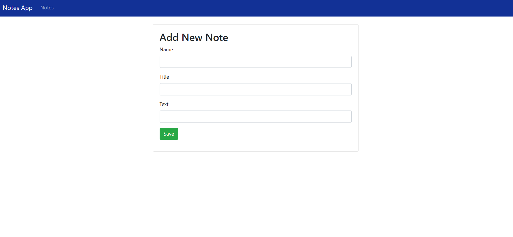

# Quiz 2 WEBPRO - 5025211015

| NRP | Name |
| --- | --- |
| 5025211015 | Muhammad Daffa Ashdaqfillah |

## Table of Contents
  - [Page Layout (View)](#page-layout-view)
  - [Features-Implementation-Analysis](#features-implementation-analysis)
    - [1. Create New Note](#1-create-new-note)
    - [2. Edit Note](#2-edit-note)
    - [3. Delete Note](#3-delete-note)
    - [4. Show List All Note](#4-show-list-all-note)
    - [5. Sort by Name Asc](#5-sort-by-name-asc)
    - [6. Sort by Name Desc](#6-sort-by-name-desc)
    - [7. List by User](#7-list-by-user)
    - [8. Search Note](#8-search-note)
  - [Conclusion](#conclusion)
  - [Hosting Problem](#hosting-problem)

## Page Layout (View)

### 1. Create New Notes



### 2. Edit Notes


### 3. Delete Notes


### 4. Show List All Notes


### 5. Sort Notes by Name Asc


### 6. Sort Notes by Name Desc


### 7. List Notes by User


### 8. Search Note ‘Eka’


## Database

### CDM - PDM


### SQL Query

```sql
CREATE DATABASE 'q2_webpro';
USE q2_webpro;

create table notes (
	id  int(3) NOT NULL AUTO_INCREMENT,
	name varchar(120) NOT NULL,
	title varchar(220) NOT NULL,
	text varchar(120),
	PRIMARY KEY (id)
);
```

### Database Integration in JSP

```sql
package net.noteapp.data;

import java.sql.Connection;
import java.sql.DriverManager;
import java.sql.PreparedStatement;
import java.sql.ResultSet;
import java.sql.SQLException;
import java.util.ArrayList;
import java.util.List;

import net.noteapp.model.Note;

/**
 * AbstractDATA.java This DATA class provides CRUD database operations for the
 * table notes in the database.
 * 
 * @author Muhammad Daffa Ashdaqfillah
 *
 */

public class NoteDATA {
	private String jdbcURL = "jdbc:mysql://localhost:3306/q2_webpro?useSSL=false";
	private String jdbcNotename = "root";
	private String jdbcPassword = "root";

	private static final String INSERT_NOTES_SQL = "INSERT INTO notes" + "  (name, title, text) VALUES "
			+ " (?, ?, ?);";

	private static final String SELECT_NOTE_BY_ID = "select id,name,title,text from notes where id =?";
	private static final String SELECT_ALL_NOTES = "select * from notes";
	private static final String SELECT_ALL_NOTES_SORTED_ASC = "select * from notes order by id asc";
	private static final String SELECT_ALL_NOTES_SORTED_DESC = "select * from notes order by id desc";
	private static final String SELECT_NOTES_BY_QUERY = "select * from notes where name like ? or title like ? or text like ?";
	private static final String DELETE_NOTES_SQL = "delete from notes where id = ?;";
	private static final String UPDATE_NOTES_SQL = "update notes set name = ?,title= ?, text =? where id = ?;";

	public NoteDATA() {
	}

	protected Connection getConnection() {
		Connection connection = null;
		try {
			Class.forName("com.mysql.jdbc.Driver");
			connection = DriverManager.getConnection(jdbcURL, jdbcNotename, jdbcPassword);
		} catch (SQLException e) {
			e.printStackTrace();
		} catch (ClassNotFoundException e) {

			e.printStackTrace();
		}
		return connection;
	}

	private void printSQLException(SQLException ex) {
		for (Throwable e : ex) {
			if (e instanceof SQLException) {
				e.printStackTrace(System.err);
				System.err.println("SQLState: " + ((SQLException) e).getSQLState());
				System.err.println("Error Code: " + ((SQLException) e).getErrorCode());
				System.err.println("Message: " + e.getMessage());
				Throwable t = ex.getCause();
				while (t != null) {
					System.out.println("Cause: " + t);
					t = t.getCause();
				}
			}
		}
	}

}
```

## Features-Implementation-Analysis

### 1. Create New Note

- **Create Model**
    
    ```sql
    package net.noteapp.model;
    
    /**
     * Note.java
     * This is a model class represents a Note entity
     * @author Muhammad Daffa Ashdaqfillah
     *
     */
    public class Note {
    	protected int id;
    	protected String name;
    	protected String title;
    	protected String text;
    	
    	public Note() {
    	}
    	
    	public Note(String name, String title, String text) {
    		super();
    		this.name = name;
    		this.title = title;
    		this.text = text;
    	}
    
    	public Note(int id, String name, String title, String text) {
    		super();
    		this.id = id;
    		this.name = name;
    		this.title = title;
    		this.text = text;
    	}
    
    	public int getId() {
    		return id;
    	}
    	public void setId(int id) {
    		this.id = id;
    	}
    	public String getName() {
    		return name;
    	}
    	public void setName(String name) {
    		this.name = name;
    	}
    	public String getTitle() {
    		return title;
    	}
    	public void setTitle(String title) {
    		this.title = title;
    	}
    	public String getText() {
    		return text;
    	}
    	public void setText(String text) {
    		this.text = text;
    	}
    }
    ```
    
- **Code in Controller**
    
    ```sql
    # In Web Servlet
    private void showNewForm(HttpServletRequest request, HttpServletResponse response)
    		throws ServletException, IOException {
    		RequestDispatcher dispatcher = request.getRequestDispatcher("note-form.jsp");
    		dispatcher.forward(request, response);
    }
    
    #in Data Query
    private static final String INSERT_NOTES_SQL = "INSERT INTO notes" + "  (name, title, text) VALUES "
    			+ " (?, ?, ?);";
    public void insertNote(Note note) throws SQLException {
    		System.out.println(INSERT_NOTES_SQL);
    
    		try (Connection connection = getConnection();
    				PreparedStatement preparedStatement = connection.prepareStatement(INSERT_NOTES_SQL)) {
    			preparedStatement.setString(1, note.getName());
    			preparedStatement.setString(2, note.getTitle());
    			preparedStatement.setString(3, note.getText());
    			System.out.println(preparedStatement);
    			preparedStatement.executeUpdate();
    		} catch (SQLException e) {
    			printSQLException(e);
    		}
    }
    ```
    
- **Code in View**
    
    ```sql
    <c:if test="${note != null}">
    	<form action="update" method="post">
    </c:if>
    <c:if test="${note == null}">
    	<form action="insert" method="post">
    </c:if>
    
    <caption>
    	<h2>
    	<c:if test="${note != null}">
    		 Edit Note
    	 </c:if>
    	<c:if test="${note == null}">
    		 Add New Note
    	 </c:if>
    	</h2>
    </caption>
    
    <c:if test="${note != null}">
    	<input type="hidden" name="id" value="<c:out value='${note.id}' />" />
    </c:if>
    
    <fieldset class="form-group">
    	<label>Name</label> <input type="text"
    	value="<c:out value='${note.name}' />" class="form-control"
    	name="name" required="required">
    </fieldset>
    
    <fieldset class="form-group">
    	<label>Title</label> <input type="text"
    	value="<c:out value='${note.title}' />" class="form-control"
    	name="title">
    </fieldset>
    
    <fieldset class="form-group">
    	<label>Text</label> <input type="text"
    	value="<c:out value='${note.text}' />" class="form-control"
    	name="text">
    </fieldset>
    
    <button type="submit" class="btn btn-success">Save</button>
    </form>
    ```
    
- **Analysis**
    
    This code aims to create the functionality of creating a new note (Create New Note) in a web application. In the **`Note`** model, there is a representation of the note entity with properties such as ID, name, title, and text. Two constructors allow the creation of **`Note`** objects with and without an ID. In the Controller section, the **`showNewForm`** method forwards the request to the **`note-form.jsp`** page to display the form for creating a new note. In the Data Query section, there is an SQL query to insert a new note into the database using **`INSERT_NOTES_SQL`**. The **`insertNote`** method takes a **`Note`** object and inserts its values into the query to be executed on the database.
    
    In the View section, there is JSP logic that determines whether the form is used to create a new note or edit an existing note. If a **`note`** object exists, the form will display the existing note information for editing; if not, the form will display empty fields for creating a new note. Each field is filled with the values from the **`note`** object if it exists, and the "Save" button triggers the submission of data to the server. Overall, this code integrates the model, view, and controller to support the operations of creating a new note or editing an existing note in a web application.
    

### 2. Edit Note

- **Code in Controller**
    
    ```sql
    # In Web Servlet
    private void updateNote(HttpServletRequest request, HttpServletResponse response) 
    			throws SQLException, IOException {
    		int id = Integer.parseInt(request.getParameter("id"));
    		String name = request.getParameter("name");
    		String title = request.getParameter("title");
    		String text = request.getParameter("text");
    
    		Note book = new Note(id, name, title, text);
    		noteDATA.updateNote(book);
    		response.sendRedirect("list");
    }
    
    #in Data Query
    private static final String UPDATE_NOTES_SQL = "update notes set name = ?,title= ?, text =? where id = ?;";
    public boolean updateNote(Note note) throws SQLException {
    		boolean rowUpdated;
    		try (Connection connection = getConnection();
    				PreparedStatement statement = connection.prepareStatement(UPDATE_NOTES_SQL);) {
    			statement.setString(1, note.getName());
    			statement.setString(2, note.getTitle());
    			statement.setString(3, note.getText());
    			statement.setInt(4, note.getId());
    
    			rowUpdated = statement.executeUpdate() > 0;
    		}
    		return rowUpdated;
    }
    ```
    
- **Code in View**
    
    ```sql
    <c:if test="${note != null}">
    	<form action="update" method="post">
    </c:if>
    <c:if test="${note == null}">
    	<form action="insert" method="post">
    </c:if>
    
    <caption>
    	<h2>
    	<c:if test="${note != null}">
    		 Edit Note
    	 </c:if>
    	<c:if test="${note == null}">
    		 Add New Note
    	 </c:if>
    	</h2>
    </caption>
    
    <c:if test="${note != null}">
    	<input type="hidden" name="id" value="<c:out value='${note.id}' />" />
    </c:if>
    
    <fieldset class="form-group">
    	<label>Name</label> <input type="text"
    	value="<c:out value='${note.name}' />" class="form-control"
    	name="name" required="required">
    </fieldset>
    
    <fieldset class="form-group">
    	<label>Title</label> <input type="text"
    	value="<c:out value='${note.title}' />" class="form-control"
    	name="title">
    </fieldset>
    
    <fieldset class="form-group">
    	<label>Text</label> <input type="text"
    	value="<c:out value='${note.text}' />" class="form-control"
    	name="text">
    </fieldset>
    
    <button type="submit" class="btn btn-success">Save</button>
    </form>
    ```
    
- **Analysis**
    
    This code is responsible for managing the edit note function in an application. In the Controller section, the **`updateNote`** method receives an HTTP request from a web page with parameters containing the ID, name, title, and text of the note to be edited. These values are then used to create a **`Note`** object and sent to the **`updateNote`** method in the **`noteDATA`** class. There, an SQL query is executed to update the corresponding note entry in the database. After the process is completed, the user will be redirected back to the note list page using **`response.sendRedirect`**.
    
    In the View section, there is a form that allows users to edit or add a new note. If there is a value in the **`note`** object, the form is set to edit the note by providing initial values taken from the **`note`** object. If the **`note`** object is empty, the form is prepared for adding a new note. Each section of the form (name, title, and text) has an input field filled with values from the **`note`** object. The 'Save' button will send the data to the controller for further processing.
    

### 3. Delete Note

- **Code in Controller**
    
    ```sql
    # In Web Servlet
    private void deleteNote(HttpServletRequest request, HttpServletResponse response) 
    			throws SQLException, IOException {
    		int id = Integer.parseInt(request.getParameter("id"));
    		noteDATA.deleteNote(id);
    		response.sendRedirect("list");
    
    }
    
    # In Data Query
    private static final String DELETE_NOTES_SQL = "delete from notes where id = ?;";
    public boolean deleteNote(int id) throws SQLException {
    		boolean rowDeleted;
    		try (Connection connection = getConnection();
    				PreparedStatement statement = connection.prepareStatement(DELETE_NOTES_SQL);) {
    			statement.setInt(1, id);
    			rowDeleted = statement.executeUpdate() > 0;
    		}
    		return rowDeleted;
    	}
    ```
    
- **Code in View**
    
    ```sql
    <tr>
    	 <td><c:out value="${note.id}" /></td>
    	 <td><c:out value="${note.name}" /></td>
    	 <td><c:out value="${note.title}" /></td>
    	 <td><c:out value="${note.text}" /></td>
    	 <td>
    		 <a href="edit?id=<c:out value='${note.id}' />">Edit</a>
    		 &nbsp;&nbsp;&nbsp;&nbsp;
    		 <a href="delete?id=<c:out value='${note.id}' />">Delete</a>
    	 </td>
    </tr>
    ```
    
- **Analysis**
    
    This code is part of a web application that manages notes. This function is responsible for deleting a specific note from the database. In the controller, the **`deleteNote`** function receives an HTTP request to delete a note based on the provided ID. First, the function retrieves the note ID from the request parameter and calls the **`deleteNote`** function in the data layer. This data layer uses a **`DELETE`** SQL query to delete the note from the database based on the provided ID. This deletion process is performed within a **`try-with-resources`** block that ensures the database connection is properly closed after the deletion is completed. As a result, this function will return **`true`** if the deletion is successful and **`false`** if no rows are affected.
    
    On the frontend, in the HTML/JSP code, each note row in the table has a "Delete" link that points to the deletion function with the corresponding note ID. This link provides easy access for users to delete a specific note from the web interface. When the user clicks the "Delete" link, a request is sent with the associated note ID, triggering the deletion function that will remove that note from the database.
    

### 4. Show List All Note

- **Code in Controller**
    
    ```sql
    # In Web Servlet
    private void listNote(HttpServletRequest request, HttpServletResponse response)
    			throws SQLException, IOException, ServletException {
    		List<Note> listNote = noteDATA.selectAllNotes();
    		request.setAttribute("listNote", listNote);
    		RequestDispatcher dispatcher = request.getRequestDispatcher("note-list.jsp");
    		dispatcher.forward(request, response);
    }
    
    # In Data Query
    private static final String SELECT_ALL_NOTES = "select * from notes";
    public List<Note> selectAllNotes() {
    
    		List<Note> notes = new ArrayList<>();
    
    		try (Connection connection = getConnection();
    
    			PreparedStatement preparedStatement = connection.prepareStatement(SELECT_ALL_NOTES);) {
    			System.out.println(preparedStatement);
    
    			ResultSet rs = preparedStatement.executeQuery();
    
    			while (rs.next()) {
    				int id = rs.getInt("id");
    				String name = rs.getString("name");
    				String title = rs.getString("title");
    				String text = rs.getString("text");
    				notes.add(new Note(id, name, title, text));
    			}
    		} catch (SQLException e) {
    			printSQLException(e);
    		}
    		return notes;
    }
    ```
    
- **Code in View**
    
    ```sql
    <c:forEach var="note" items="${listNote}">
    	 <tr>
    		 <td><c:out value="${note.id}" /></td>
    		 <td><c:out value="${note.name}" /></td>
    		 <td><c:out value="${note.title}" /></td>
    		 <td><c:out value="${note.text}" /></td>
    		 <td>
    			 <a href="edit?id=<c:out value='${note.id}' />">Edit</a>
    			 &nbsp;&nbsp;&nbsp;&nbsp;
    			 <a href="delete?id=<c:out value='${note.id}' />">Delete</a>
    		 </td>
    	 </tr>
    </c:forEach>
    ```
    
- **Analysis**
    
    The given code has two main parts: the first one is the controller part that handles the request to display a list of all notes (**`listNote`**), and the second one is the view part that uses JSTL tags (**`<c:forEach>`**) to generate a table view of the received list of notes.
    
    The controller part (**`listNote`** method) first retrieves all the notes from the database using the SQL query **`SELECT * FROM notes`**. By using PreparedStatement, the query is executed to fetch all the rows of notes from the table. For each row retrieved from the query, the values of its columns are extracted to create a **`Note`** object. These **`Note`** objects are then added to a list, which is eventually returned as the result of the **`selectAllNotes()`** function.
    
    The View part uses the JSTL tag **`<c:forEach>`** to iterate through each **`Note`** object in the **`listNote`** received from the controller. Each **`Note`** object is represented as a row in an HTML table, where each column represents an attribute of the **`Note`** object such as ID, name, title, and note content. There are also "Edit" and "Delete" hyperlinks that use the ID of each note to form the appropriate URL for editing or deleting that note.
    

### 5. Sort by Name Asc

- **Code in Controller**
    
    ```sql
    # In Web Servlet
    private void listNoteASC(HttpServletRequest request, HttpServletResponse response)
    			throws SQLException, IOException, ServletException {
    		List<Note> listNote = noteDATA.selectAllNotesASC();
    		request.setAttribute("listNote", listNote);
    		RequestDispatcher dispatcher = request.getRequestDispatcher("note-list.jsp");
    		dispatcher.forward(request, response);
    }
    
    # In Data Query
    private static final String SELECT_ALL_NOTES_SORTED_ASC = "select * from notes order by name asc";
    public list<Note> selectAllNotesASC() {
    		List<Note> notes = new ArrayList<>();
    
    		try (Connection connection = getConnection();
    			PreparedStatement preparedStatement = connection.prepareStatement(SELECT_ALL_NOTES_SORTED_ASC);) {
    
    			ResultSet rs = preparedStatement.executeQuery();
    
    			while (rs.next()) {
    				int id = rs.getInt("id");
    				String name = rs.getString("name");
    				String title = rs.getString("title");
    				String text = rs.getString("text");
    				notes.add(new Note(id, name, title, text));
    			}
    		} catch (SQLException e) {
    			printSQLException(e);
    		}
    		return notes;
    	}
    ```
    
- **Code in View**
    
    ```sql
    <c:forEach var="note" items="${listNote}">
    	 <tr>
    		 <td><c:out value="${note.id}" /></td>
    		 <td><c:out value="${note.name}" /></td>
    		 <td><c:out value="${note.title}" /></td>
    		 <td><c:out value="${note.text}" /></td>
    		 <td>
    			 <a href="edit?id=<c:out value='${note.id}' />">Edit</a>
    			 &nbsp;&nbsp;&nbsp;&nbsp;
    			 <a href="delete?id=<c:out value='${note.id}' />">Delete</a>
    		 </td>
    	 </tr>
    </c:forEach>
    ```
    
- **Analysis**
    
    The presented code retrieves data from the database using the query **`SELECT_ALL_NOTES_SORTED_ASC`**, which sorts the notes based on their name in ascending order. This functionality can be seen in the section **`select*from notes order by name asc`**, where the data is collected from the "notes" table and sorted by ID.
    
    Furthermore, the sorted note data is stored in a **`List<Note>`** object within the **`selectAllNotesASC()`** method in the Data Query class.
    
    Next, in the Controller, the sorted data is sent to the JSP page using **`request.setAttribute("listNote", listNote)`**. In the JSP page, the **`<c:forEach>`** JSTL tag is used to access and display the data from **`listNote`** in the form of a table, showing the ID, name, title, and text of each note. In the context of the View, this allows users to view a list of notes sorted by name in ascending order and also provides options to edit or delete each note.
    

### 6. Sort by Name Desc

- **Code in Controller**
    
    ```sql
    # In Web Servlet
    private void listNoteDESC(HttpServletRequest request, HttpServletResponse response)
    			throws SQLException, IOException, ServletException {
    		List<Note> listNote = noteDATA.selectAllNotesDESC();
    		request.setAttribute("listNote", listNote);
    		RequestDispatcher dispatcher = request.getRequestDispatcher("note-list.jsp");
    		dispatcher.forward(request, response);
    }
    
    # In Data Query
    private static final String SELECT_ALL_NOTES_SORTED_DESC = "select * from notes order by id desc";
    public list<Note> selectAllNotesDESC() {
    		List<Note> notes = new ArrayList<>();
    
    		try (Connection connection = getConnection();
    			PreparedStatement preparedStatement = connection.prepareStatement(SELECT_ALL_NOTES_SORTED_DESC);) {
    
    			ResultSet rs = preparedStatement.executeQuery();
    
    			while (rs.next()) {
    				int id = rs.getInt("id");
    				String name = rs.getString("name");
    				String title = rs.getString("title");
    				String text = rs.getString("text");
    				notes.add(new Note(id, name, title, text));
    			}
    		} catch (SQLException e) {
    			printSQLException(e);
    		}
    		return notes;
    	}
    ```
    
- **Code in View**
    
    ```sql
    <c:forEach var="note" items="${listNote}">
    	 <tr>
    		 <td><c:out value="${note.id}" /></td>
    		 <td><c:out value="${note.name}" /></td>
    		 <td><c:out value="${note.title}" /></td>
    		 <td><c:out value="${note.text}" /></td>
    		 <td>
    			 <a href="edit?id=<c:out value='${note.id}' />">Edit</a>
    			 &nbsp;&nbsp;&nbsp;&nbsp;
    			 <a href="delete?id=<c:out value='${note.id}' />">Delete</a>
    		 </td>
    	 </tr>
    </c:forEach>
    ```
    
- **Analysis**
    
    The provided code is part of a web application that handles retrieving data from a database and displaying it on a web page. The focus is on retrieving a list of notes from the database and displaying them in descending order by name on the web page.
    
    On the Controller side, the **`listNoteDESC`** function receives a request from the client, then uses the **`selectAllNotesDESC`** method from the **`noteDATA`** class to retrieve a list of notes that have been sorted in descending order by name. Then, this list of notes is stored as a request attribute with the name "listNote" so that it can be accessed on the JSP page. Finally, using **`RequestDispatcher`**, this data is forwarded to the "note-list.jsp" page to be displayed to the user.
    
    On the Data Query side, the **`selectAllNotesDESC`** method executes an SQL query that retrieves all notes from the **`notes`** table, sorted in descending order by the **`name`** column. Then, the data from the query result is fetched, each row is represented as a **`Note`** object, and these objects are added to a **`notes`** list which is then returned as the result of the method.
    
    On the View side, using the JSTL **`<c:forEach>`** tag, the "note-list.jsp" page displays each note from the "listNote" received from the Controller. Each note is displayed in a table row with columns for ID, name, title, and note text. Additionally, there are links to edit and delete each note.
    

### 7. List by User

- Code in Controller
    
    ```sql
    # In Web Servlet
    private void listbyuser(HttpServletRequest request, HttpServletResponse response)
    			throws SQLException, IOException, ServletException {
    		List<Note> listNote = noteDATA.selectbyuser();
    		request.setAttribute("listNote", listNote);
    		RequestDispatcher dispatcher = request.getRequestDispatcher("note-list.jsp");
    		dispatcher.forward(request, response);
    }
    
    # In Data Query
    private static final String SELECT_BY_USER = "select * from notes group by name";
    public list<Note> selectbyuser() {
    		List<Note> notes = new ArrayList<>();
    
    		try (Connection connection = getConnection();
    			PreparedStatement preparedStatement = connection.prepareStatement(SELECT_BY_USER);) {
    
    			ResultSet rs = preparedStatement.executeQuery();
    
    			while (rs.next()) {
    				int id = rs.getInt("id");
    				String name = rs.getString("name");
    				String title = rs.getString("title");
    				String text = rs.getString("text");
    				notes.add(new Note(id, name, title, text));
    			}
    		} catch (SQLException e) {
    			printSQLException(e);
    		}
    		return notes;
    	}
    ```
    
- **Code in View**
    
    ```sql
    <c:forEach var="note" items="${listNote}">
    	 <tr>
    		 <td><c:out value="${note.id}" /></td>
    		 <td><c:out value="${note.name}" /></td>
    		 <td><c:out value="${note.title}" /></td>
    		 <td><c:out value="${note.text}" /></td>
    		 <td>
    			 <a href="edit?id=<c:out value='${note.id}' />">Edit</a>
    			 &nbsp;&nbsp;&nbsp;&nbsp;
    			 <a href="delete?id=<c:out value='${note.id}' />">Delete</a>
    		 </td>
    	 </tr>
    </c:forEach>
    ```
    
- **Analysis**
    
    The code in the controller **`listbyuser()`** arranges the data obtained from the **`noteDATA.selectbyuser()`** call into the request attribute **`listNote`**, grouped by name. Then, this data is forwarded to the **`note-list.jsp`** page. In the JSP page, using the JSTL tag **`<c:forEach>`**, each note retrieved from the **`listNote`** attribute is displayed in the form of a table with columns indicating the ID, username, title, and note text.
    

### 8. Search Note

- **Code in Controller**
    
    ```sql
    # In Web Servlet
    private void searchNote(HttpServletRequest request, HttpServletResponse response)
    			throws SQLException, IOException, ServletException {
    		String name = request.getParameter("name");
    		List<Note> listNote = noteDATA.searchNotes(name);
    		request.setAttribute("listNote", listNote);
    		RequestDispatcher dispatcher = request.getRequestDispatcher("note-list.jsp");
    		dispatcher.forward(request, response);
    }
    
    # In Data Query
    private static final String SELECT_NOTES_BY_QUERY = "select * from notes where name like ? or title like ? or text like ?";
    public List<Note> searchNotes(String query) {
    		List<Note> notes = new ArrayList<>();
    
    		try (Connection connection = getConnection();
    			PreparedStatement preparedStatement = connection.prepareStatement(SELECT_NOTES_BY_QUERY);) {
    
    			preparedStatement.setString(1, "%" + query + "%");
    			ResultSet rs = preparedStatement.executeQuery();
    
    			while (rs.next()) {
    				int id = rs.getInt("id");
    				String name = rs.getString("name");
    				String title = rs.getString("title");
    				String text = rs.getString("text");
    				notes.add(new Note(id, name, title, text));
    			}
    		} catch (SQLException e) {
    			printSQLException(e);
    		}
    		return notes;
    	}
    ```
    
- **Code in View**
    
    ```sql
    <c:forEach var="note" items="${listNote}">
    	 <tr>
    		 <td><c:out value="${note.id}" /></td>
    		 <td><c:out value="${note.name}" /></td>
    		 <td><c:out value="${note.title}" /></td>
    		 <td><c:out value="${note.text}" /></td>
    		 <td>
    			 <a href="edit?id=<c:out value='${note.id}' />">Edit</a>
    			 &nbsp;&nbsp;&nbsp;&nbsp;
    			 <a href="delete?id=<c:out value='${note.id}' />">Delete</a>
    		 </td>
    	 </tr>
    </c:forEach>
    ```
    
- **Analysis**
    
    The provided code is part of a note search feature in an application. On the Controller side, the **`searchNote`** function takes the name parameter from the HTTP request, executes a search using the **`searchNotes`** method from **`noteDATA`** (possibly a class or object responsible for managing note data), and then passes the result to the **`note-list.jsp`** page. The **`searchNotes`** method on the Data Query side performs a search using an SQL query that allows searching for note data based on name, title, or content using the **`LIKE`** operation in SQL. This enables more flexible searching by using patterns that match the received parameters. The search result is then converted into a list of note objects and returned.
    

## Conclusion

This Quiz 2 Project is done by using JSP (Java/Jakarta Server Pages) made by IDE eclips and Apache Tomcat Server. For this project, I create a Notes App where users can enter notes in a form consisting of name, title, and text fields. In this project, only one table is used, which is the notes table, because I am still new to using JSP and it would be complicated to use multiple tables.

In its implementation, JSP uses the MVC (Model-View-Controller) architecture. In this project, the model is stored in model.note.java, the controller uses Servlet, and the database uses MySQL which is managed in NoteDATA.java. Every function called from the view will be directed to the servlet and return the data retrieved from the database through NoteDATA.

In this project, I have implemented 8 CRUD features, which are Create Note, Edit Note, List Notes, List Note by User, Delete Note, Search Notes, Sort Notes by Asc, and Sort Notes by Desc.

## Hosting Problem
I can't find a free web host that actually has JSP support built in. Because to host with JSP, i need a servlet container. In this project, i use Apache Tomcat to be my servlet containers. I can't host my project in Github Pages, Netlify, Vercel, or Heroku because they don't support JSP Module.